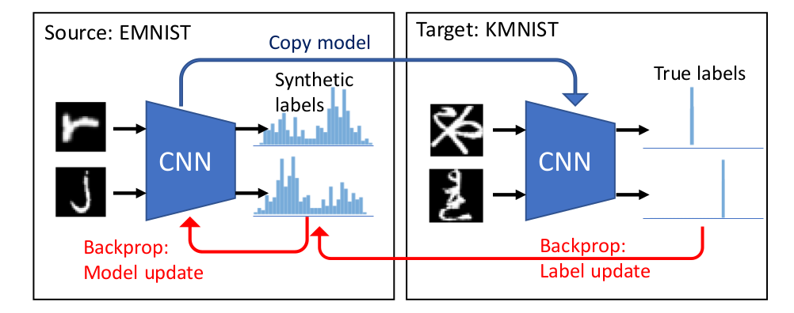

# Flexible Dataset Distillation: Learn Labels Instead of Images

<p align="center"></p>

[[Paper]](https://arxiv.org/abs/2006.08572)

We study the problem of dataset distillation – creating a small set of synthetic examples capable of training a good model. In particular, we study the problem of label distillation – creating synthetic labels for a small set of real images, and show it to be more effective than the prior image-based approach to dataset distillation. Methodologically, we introduce a more robust and flexible meta-learning algorithm for distillation, as well as an effective first-order strategy based on convex optimization layers. Distilling labels with our new algorithm leads to improved results over prior image-based distillation. More importantly, it leads to clear improvements in flexibility of the distilled dataset in terms of compatibility with offthe-shelf optimizers and diverse neural architectures. Interestingly, label distillation can also be applied across datasets, for example enabling learning Japanese character recognition by training only on synthetically labeled English letters.

## Prerequisites

### System requirements
- Python 3
- CPU or NVIDIA GPU + CUDA

### Dependencies
- ``torch >= 1.0.1``
- ``torchvision >= 0.2.2``
- ``numpy``
- ``tqdm``

Earlier versions may be compatible too (and newer versions may need some changes in ``torch`` syntax to be compatible).

### Datasets
The code will automatically download most datasets, but CUB and Kuzushiji-49 need to be downloaded separately.

Instructions for downloading CUB images are [here](http://www.vision.caltech.edu/visipedia/CUB-200-2011.html), while instructions for Kuzushiji-49 are [here](https://github.com/rois-codh/kmnist).

After downloading the datasets, place them into ``data`` directory so that CUB images are available in ``data/CUB_200_2011/images`` (after extracting) and Kuzushiji-49 ``.npz`` files are available in ``data`` directory.


## Experiments

### How to run experiments?
The easiest way to run experiments is by using one of the configuration ``json`` files (modifying parts as needed). Example is shown here, but you can easily use another configuration file (see ``experiment_configs`` directory). Description of what the individual parts of the configuration file name mean are in ``NameDescription.md`` file located in ``experiment_configs`` directory. File ``configs.txt`` located in the same directory lists all attached configuration files. We provide configuration files for all main experiments as well as most analysis experiments.

Label distillation experiment with second-order approach:

``python label_distillation_or2.py --filepath_to_arguments_json_file experiment_configs/ld_100be_50ib_mn_to_mn_bl_cnn_400e_or2_1234s_v0.json``

Label distillation experiment with first-order ridge regression approach:

``python label_distillation_rr.py --filepath_to_arguments_json_file experiment_configs/ld_100be_50ib_mn_to_mn_bl_cnn_400e_rr_1234s_v0.json``

These scripts do both training and evaluation. If you want to quickly try an experiment without creating a new configuration file (or using one of the provided files), you can use ``short_experiment.sh``.

To make creating configuration files easier, we have created a Jupyter notebook that allows creating many of them efficiently (``GenerateExperiments.ipynb`` in ``notebooks`` directory).

You can also specify the arguments directly (for a list of arguments look at ``arg_extractor.py``).

In addition, we provide code for distilling images (``data_distillation_or2.py`` and ``data_distillation_rr.py``). We have not obtained strong results with these, but they can be useful nevertheless.

### How to analyse results?

The results of experiments as well as statistics about the training are saved as ``json`` files in ``results`` directory, using the name of the experiment. The information stored typically includes information about training and validation error rates across different epochs, test errors across 20 repetitions, total training time (in seconds), best synthetic labels for a set of base examples (original base example labels are stored too) as well as the number of steps used for training validation and test models. Our experiments report error rates rather than accuracies, so to obtain accuracies it is needed to calculate them from the error rates.

## Citation

If you find this useful for your research, please consider citing:
 ```
 @article{bohdal2020flexible,
   title={Flexible Dataset Distillation: Learn Labels Instead of Images},
   author={Bohdal, Ondrej and Yang, Yongxin and Hospedales, Timothy},
   journal={arXiv preprint arXiv:2006.08572},
   year={2020}
}
 ```

## Acknowledgments

This work was supported in part by the EPSRC Centre for Doctoral Training in Data Science, funded by the UK Engineering and Physical Sciences Research Council (grant EP/L016427/1) and the University of Edinburgh.